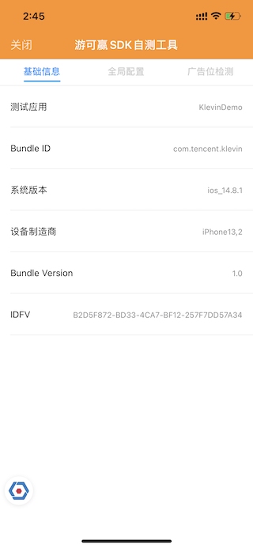
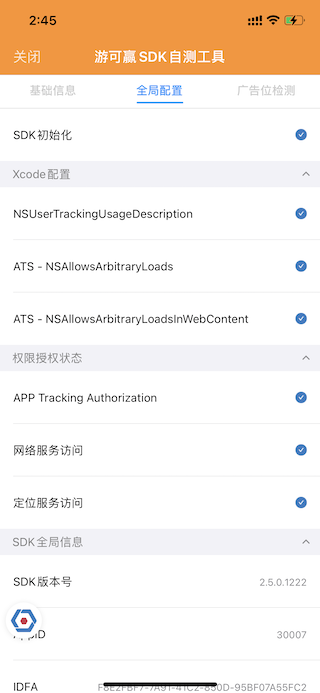
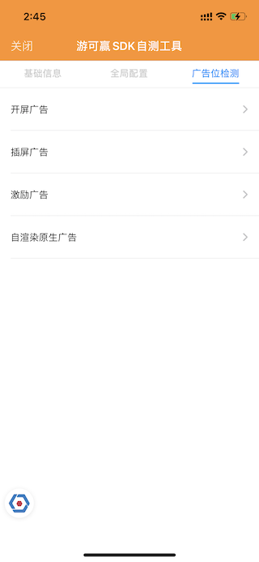

# iOS 自测工具接入指南

## 工具介绍

在接入游可赢SDK阶段，开发者可通过自测工具对接入过程中的必要操作进行检查，提高开发者接入测试的效率。

自测工具包括以下功能：

- 基础信息：显示设备、应用及系统的相关基础信息；
- 全局配置：显示及检测应用工程配置、建议权限状态及SDK全局信息等；
- 广告位检测：对不同的广告类型信息及样式进行预览。

## 接入流程

#### 依赖游可赢AdSDK

请参考[游可赢AdSDK iOS接入文档](https://yky.qq.com/doc/sdk/iOS/)接入iOS SDK；

#### Cocoapods集成

在项目的 `Podfile` 文件中添加以下代码：

```
pod 'KlevinTestMeasurement', :git => 'https://github.com/KlevinTech/KlevinTestMeasurement.git'
```

然后使用命令行运行：

```
pod install
```

#### 手动集成

将提供的 `KlevinTestMeasurement.framework` 文件拖到 `XCode` 工程内（勾选 `Copy items if needed` 选项）

#### 在合适的位置按照以下方式添加测试工具入口代码

```
// 在测试配置下引入 KlevinTestMeasurement 头文件
#ifdef KLEVIN_TEST_MEASUREMENT
#import <KlevinTestMeasurement/KlevinTestMeasurement.h>
#endif

·····

- (BOOL)application:(UIApplication *)application 
didFinishLaunchingWithOptions:(NSDictionary *)launchOptions {
    // Override point for customization after application launch.

// 是合适的位置添加入口代码，支持通过悬浮入口，或摇一摇手势进入
#ifdef KLEVIN_TEST_MEASUREMENT
    [KlevinTestMeasurement startOnWindow:self.window 
						 withIconShowing:YES
					enableMotionResponse:NO];
#endif

	return YES;
}

```

## 使用简介

### 基础信息

开发者可通过 `基础信息` 页面所展示的内容查看当前应用的基础信息，包括：`Bundle ID`、`IDFV`、`系统版本`等。

| 页面示例 | 详细参数 | 
| :------:| :------| 
|  | **测试应用**：应用名称<br> **Bundle ID**：应用标识<br>**系统版本**：iOS版本号 <br>**设备制造商**：设备型号 <br>**Bundle Version**：应用版本号 <br> **IDFV**：供应商标识符| 

### 全局配置

开发者可通过 `全局配置` 页面检查是否正常初始化游可赢广告SDK、Xcode工程配置、权限授权情况等；开发者可对照检测结果对异常项进行排查修复。

| 页面示例 | 详细参数 | 
| :------:| :------| 
|   |**SDK初始化**：检测广告SDK是否初始化成功 <br><br>**Xcode配置**: 检测工程是否已配置建议项，包括： <br>- `NSUserTrackingUsageDescription` 适配iOS 14的隐私及数据使用说明 <br>- `ATS相关配置` 游可赢SDK建议配置项，允许HTTP协议的请求。 <br><br>**权限授权状态**：当前应用的关键权限状态，包括： <br>- 隐私及数据使用授权（IDFA） <br>- 网络服务访问授权 <br>- 定位服务访问授权 <br><br>**SDK 全局信息**：游可赢广告SDK的核心信息，包括： <br>- SDK版本号 <br>- AppID（游可赢平台的应用ID） <br>- IDFA值 <br>- CAID值 <br> | 


### 广告位检测

开发者可通过 `广告位检测` 页面进入指定类型的广告调试页面，通过输入指定的应用ID、广告位ID，即可在应用中快速加载对应的广告及预览效果。

暂不支持在线加载当前应用ID所配置的广告位列表。

| 页面示例 | 详细参数 | 
| :------:| :------| 
|  | 游可赢提供的测试广告位ID信息：<br><br>**AppID：** 30007<br>**开屏PosId：** 30033<br>**激励PosId：** 30027<br>**插屏PosId：** 30023<br>**原生自渲染PosId：** 32798<br> | 

## ⚠️注意事项

1. 游可赢开发者自测工具，旨在帮助开发者接入游可赢SDK后，对接入的关键事项进行检查，并在测试状态下进行调试。
2. 测试工具中显示的各项信息，仅用于对开发者进行重要接入项检测提醒。
3. 在自测工具使用完毕后，开发者切记要将与测试工具相关的代码删除，以免对即将发布的应用产生不必要的影响。
